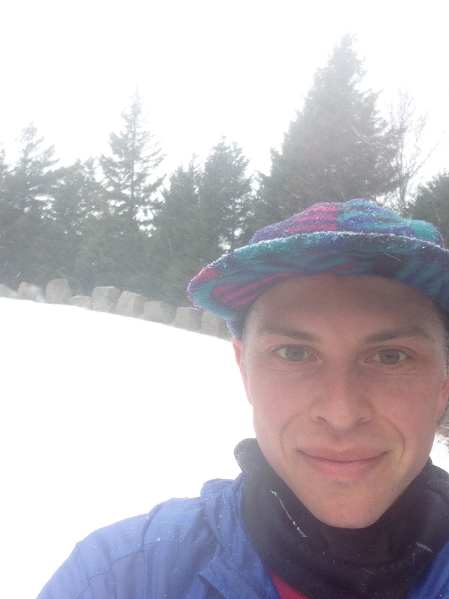

<figure>
  <!--
  
  <figcaption>Around Mountain Loop, Acadia</figcaption>
  -->
  <!--
  
  <figcaption>Col de Balme, CH/FR (September 2017)</figcaption>
  -->
  
  <figcaption>
    Photo courtesy of
    <a href="http://evainfeld.net/">Eva Kłejt</a>
  </figcaption>
</figure>

I am currently a Ph.D. candidate at
[Dartmouth College](https://math.dartmouth.edu)
working under the supervision of
[John Voight](https://math.dartmouth.edu/~jvoight)

Here is an updated version of my resume:
 
[Resume](https://www.dropbox.com/s/cn1q5q8ft6cpt04/musty_resume.pdf?dl=0){:class="btn btn--gray center"}

Here is a poster describing some of my research:
 
[Belyi Maps Poster](assets/belyi_poster.pdf){:class="btn btn--gray"}

I have organized some of my research data at:
 
[dessin explorer](https://dessin-explorer.org){:class="btn btn--gray"}

Here are some of my professional academic resources:
 
[Research Statement](https://www.dropbox.com/s/z79kwoodj1b7zjf/research.pdf?dl=0){:class="btn btn--gray"}
 
[Teaching Statement](https://www.dropbox.com/s/xk3tytbb89n03nz/teaching-statement.pdf?dl=0){:class="btn btn--gray"}
 
[Publication List](https://www.dropbox.com/s/h51dqlbnkjupb57/musty_publication_list.pdf?dl=0){:class="btn btn--gray"}
